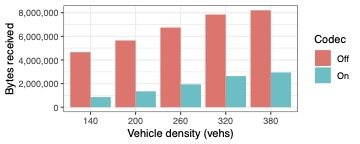
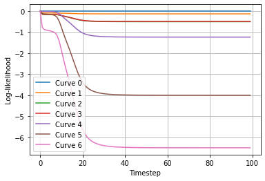
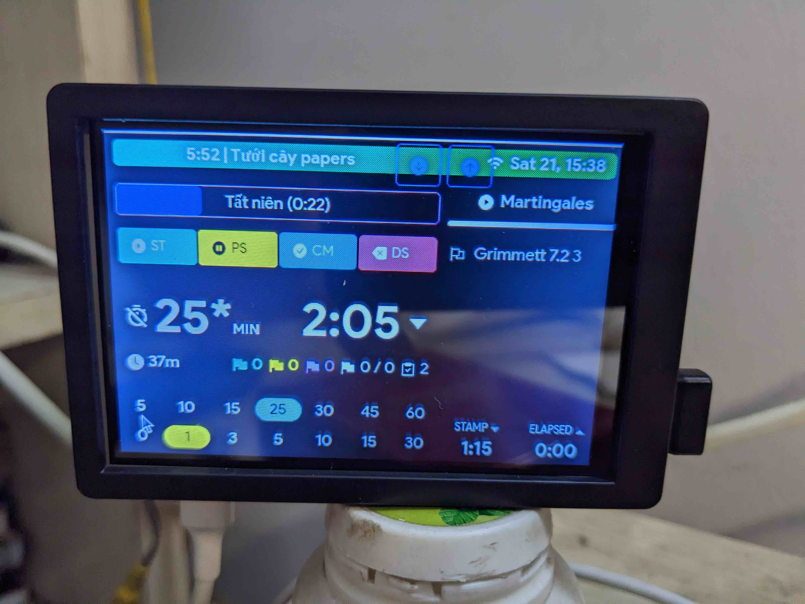

{: style="float: left; margin-right: 20px; margin-bottom: 10px" : width="150"}
## [Thinh Hoang Dinh (Edwin Hoang)](about.md) 
I am a PhD student at the French Civil Aviation University (ENAC) Optimization Laboratory, affiliated with the Artificial and Natural Intelligence Toulouse Institute (ANITI) and NXP Semiconductors Toulouse, France. Currently, I am conducting research in the field of **vehicular communications, signal processing and machine learning in Intelligent Transportation Systems** under supervision of Pr. Daniel Delahaye (ENAC) and Pr. Pierre Maréchal (Toulouse Institute of Mathematics). [See more](about.md).

## Contact
- Email: [thinh.hoang-dinh@univ-toulouse.fr](mailto:thinh.hoang-dinh@univ-toulouse.fr).

I'm available for a Postdoctoral Researcher position, preferably in the United States or in France. My complete CV is [here](cv.pdf).


**I'm available for a Postdoctoral Researcher position from October '23, preferably in the United States, United Kingdom and Australia. My complete CV is [here](cv.pdf).**


## Research Interests
My doctoral dissertation focused on signal processing and unsupervised learning of road vehicle trajectory data. I've also had some work in sparse optimization, large language models, and recently, I've been working on theoretical reinforcement learning.

# Highlight Work

{: style="float: left; margin-right: 10px; margin-bottom: 130px" : width="90%"}
{: .left-50}

## StratoEye (Montéllama Codex + Web Platforms)

This project aims to leverage the power of large language models in air traffic commands comprehension and bridge the gap between Language Understanding (LU) and Trajectory Signal Processing (TSP).

This work is realized under guidance of Pr. Daniel Delahaye (ENAC), Pr. Pierre Maréchal (IMT), Laurent Lapasset (ENAC) and in collaboration with Huijuan Yang (Civil Aviation Flight University of China).

[Long demonstration video](https://youtu.be/5iVBMxKoQzo?si=0W9BcUABG7KrwigL)

[Short demonstration video](https://www.youtube.com/watch?v=SjR---olr7k)

[Project Description](StratoEyeSite.pdf)

{: .right-50}

{: style="clear: both"}
{: style="clear: both"}

{: style="float: left; margin-right: 10px" : width="90%"}
{: .left-50}

## Spherical Codec
The codec reduces the Channel Busy Ratio (CBR) for CAM messages exchange by up to 2.5 times.
A European Patent has been filed since October '22.
{: .right-50}

{: style="clear: both"}

{: style="float: left; margin-right: 10px" : width="90%"}
{:.left-50}

## Real-time Anomaly Detection
{: .right-50}
Perform real-time estimation of the "probability of anomaly" for early warning of dangerous scenarios in Air Traffic Control.
{: .right-50}

{: style="clear: both"}

{: style="float: left; margin-right: 10px" : width="90%"}
{:.left-50}

## Leisure Project: A Productivity Tool
{: .right-50}
Using React Native, React and Firebase, I designed a small Raspberry Pi-powered smart display that shows me the to-do list with Pomodoro functions. By keeping track of the time until the next calendar event, I am also prevented from forgetting to attend meetings. By doing so, I am able to increase my productivity and stay on top of dozens of hundred tasks throughout the day.
{: .right-50}

{: style="clear: both"}

# Recent Posts
{: style="clear: both"}
  
  <li><a href="{{ BASE_PATH }}{{ post.url }}">{{ post.title }}</a></li>  
  